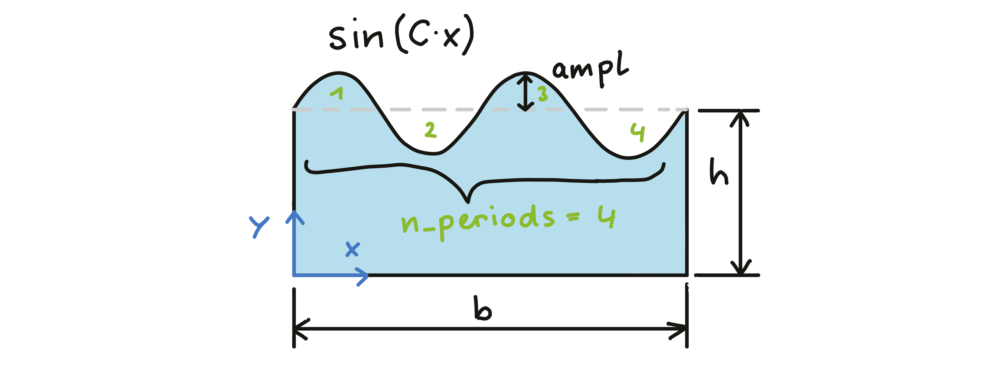
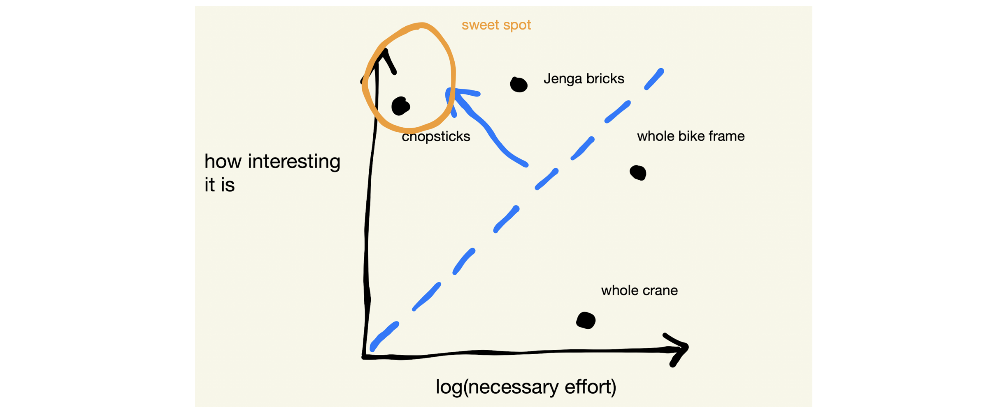

# Abaqus/Python course in the winter term 2022/23

Scripts and resources for the [Abaqus/Python](https://online.unileoben.ac.at/mu_online/pl/ui/$ctx/wbLv.wbShowLVDetail?pStpSpNr=3217352) seminar. The script of the course exists in [pdf](https://www.researchgate.net/publication/345680663_Efficient_FE_Modelling_Course_Scripting_Abaqus_CAE_using_Python) and [html](https://www.martinpletz.com/fe-scripting) form. We will go through the crucial steps for automating Abaqus CAE models using Python. Each of the participants will then apply those skills to an example that she/he presents in the final unit.

We decided to meet up on Thursdays from 1 pm to 4 pm ([dates](https://online.unileoben.ac.at/mu_online/pl/ui/$ctx/wbTvw_List.lehrveranstaltung?pStpSpNr=3217352)). If you cannot come to one of the dates, please let me know and complete the assignments of this unit on your own.

You need a laptop with Abaqus and an editor like Visual Studio Code, Atom, or Spyder on it. Later on, a Python installation including modules like NumPy and matplotlib would be nice, e.g. by installing [Anaconda](https://www.anaconda.com/download).

### Unit 1, 2023-10-05
* Record Abaqus CAE commands: .rpy, .jnl, or macro-files.
* Running scripts in Abaqus
* Some general statements and header for Abaqus Python script (import, Mdb(), etc.)
* Looked at some projects from the last years

#### Exercise
Create a sketch with a wavy surface using a spline.

### Unit 2, 2023-10-19
* Repeated stuff from unit 1
* Looked at selecting things in Abaqus including masks, findAt, bounding boxes and using other properties of the entities
* Defined the assignment of the first homework

#### Homework 1 (until unit 3, Nov. 9th)
Extend the Abaqus/Python script to do the following things:
* Use the sketch from unit 1 to create a planar part
* cut the geometry at half of the waves' height
* create sets for the bottom, left, right edge. Create one set of the upper halve of the waves and the lower half of the waves. Give the sets names that you can easily remember and use in the further model creation

> Extra effort (optional): Create separate sets for the upper and lower bumps and call them 'top-bump-01', ... Note that you can fill a string with zeros from the left using '5'.zfill(3) --> '005'

### Unit 3, 2023-11-16
* Overview of results in the `odb` file and how to extract that
* Created contour plot images together
* Looked into modeling & criterions for projects & you shared your ideas

### Unit 4, 2023-11-23
* Continued to look into the model evaluation
* Started with chapter 4 (pdf) or chapter 5 ([online](https://martinpletz.com/fe-scripting-5)), where we discussed how to assemble a scripted model.
* *the monitor cable did not work*, so the practical use of evaluation is put into the ...

#### Homework 2 (until Dec. 7th)

Further evaluate the odb we created from the inp ile in unit 3:

* Evaluate the history output and write it into a dat file: there is output of the contour integrals written to the odb: see how to obtain that.
* (for the motivated ones): Create a path that starts at the crack tip and evaluate stresses in the direction of the last crack increment. Export these data and plot it with the tool of your choice.